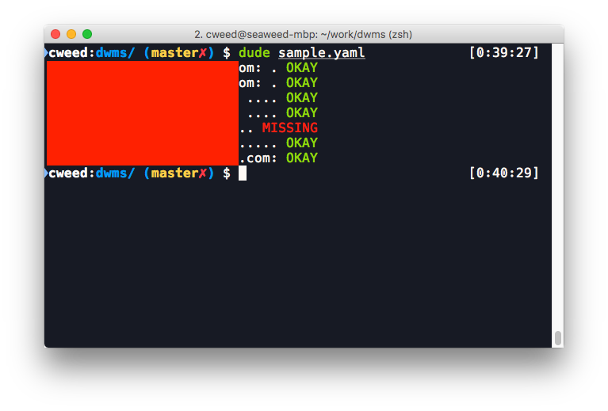

# dwms (Dude, where's my snapshots?)

If this is yelling at you, something is wrong with Elasticsearch and your snapshot stuff.

<p align="center"></p>

## Configuration

See the [sample config](config.yaml).

Configuration consists of an array of clusters, global settings, and global notifiers (this could be tweaked to be per cluster notifier(s), but this is unnecessary and I've left it unimplemented because I simply don't see any need for it at the moment).

Global settings specified under `settings` **do not** override cluster specific settings, they should be treated as the default setting.

From there specify a valid Python [strftime][] pattern to check for and it'll look for an **exact** match.

## Running ad-hoc as a CLI

DWMS can be ran as a CLI tool via `dude`.

If running as a CLI, you can avoid sending any information with `--debug`. If you specify debug mode or fail to specify any outputs dude will output to stdout by default.

You can override the date to check with `--date="YYYY-MM-DD"`. By default DWMS will check the current day.

## DWMS Usage

```
Usage: dude [OPTIONS] [CONFIG]

  Check each cluster:repo(s) pair for the patterns specified in the config
  for the current day's snapshot(s).

Options:
  --version    Show the version and exit.
  --date TEXT  Override date, use format YYYY-MM-DD
  -d, --debug  Don't send info, show everything
  --help       Show this message and exit.
```

## Reporting

Severity levels range from 0-3, "Okay" to "Shit is broken, yo".

Severity | Status
--- | ---
0 | Okay (found and successful)
1 | In progress or partial snapshot
2 | Missing snapshot
3 | Failed snapshot

These are reported on a **cluster wide** basis, not a per pattern basis. We don't need that much granularity, just the big picture. So anything missing or stuck is cause for concern and we can dig deeper once we know of a problem.

[strftime]: https://docs.python.org/3/library/datetime.html#strftime-and-strptime-behavior
